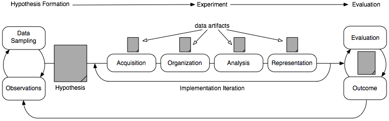

Data Science is a process of acquiring, organizing, analyzing, and representing information.  The activities in the process focus primarily on learning various technologies in support of each of the major stages of any data science process.

# How to Turn in Assignments #

If you are a student in one of my classes, you'll be using github to turn in assignments.

## Setup ##

You'll need to create a repository for your assignments.  You can [request a discount](https://education.github.com/discount_requests/new) as a 
student so that you can have a private repository.  Otherwise, all your assignments will
be publically accessible.

Once you've setup your repository, you'll want to add your instructor as a collaborator.  That way they can merge your 
pull requests when they are graded.

## The Process ##

 1. [Create a branch](https://help.github.com/articles/creating-and-deleting-branches-within-your-repository/) of your repository for the homework and make your changes in that branch.
 2. Commit and push your changes to the branch.
 3. [Create a pull request](https://help.github.com/articles/creating-a-pull-request/) for the code you'd like to turn in.
 4. Your instructor can now view the pull request and grade the assignment.
 5. Once your instructor has graded the assignment, they can merge the pull request as a final notification.
 6. You can now delete the branch as the changes have been merged with the master.
